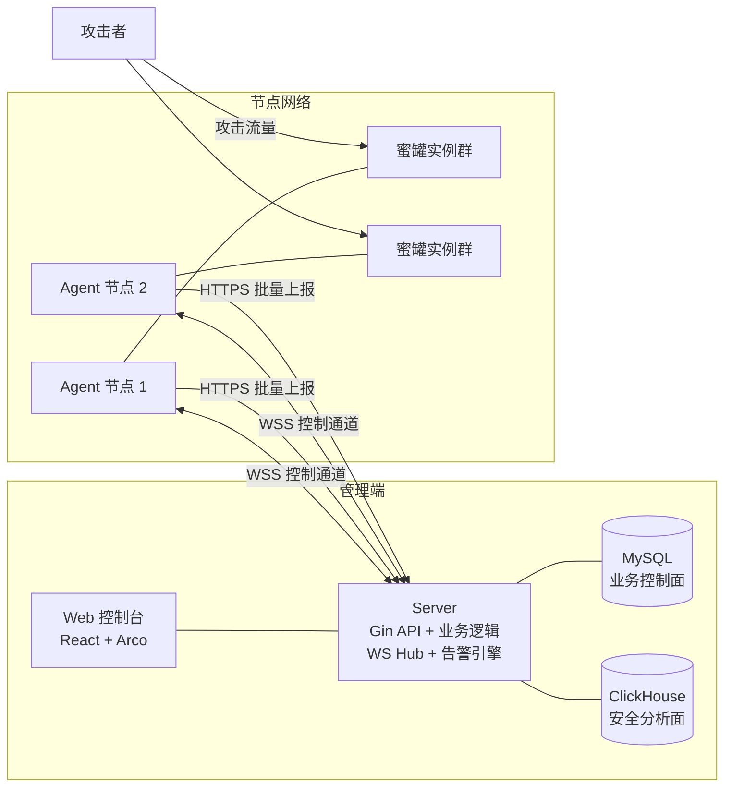

# Honeynet 蜜网蜜罐 — 完整产品架构设计

- 日期：2026-08-10
- 状态：v0.21 MySQL + ClickHouse 双引擎与分布式检测流水线基线已实现（本文同时保留历史阶段与后续演进设计）
- 定位：面向企业安全场景的蜜网系统
- 技术栈：Go（Server + Agent）、React + Arco Design（控制台）、Gin + GORM、MySQL + ClickHouse、WebSocket

## 0. 已确认的关键决策

| 决策点 | 结论 |
|---|---|
| 文档覆盖 | 完整产品架构（全部子系统到接口/协议/数据模型深度） |
| 数据引擎 | MySQL 保存业务控制面；ClickHouse 保存攻击事件和安全分析事实，不以 ClickHouse 替换 MySQL |
| Agent↔Server 协议 | WebSocket 控制通道 + HTTPS 批量上报 |
| 蜜罐服务框架 | 混合式（方案 C）：低交互服务内置 + Web 模板引擎 + 外部蜜罐接入协议 |
| 云端蜜网 | 本版不含，仅预留扩展点 |
| 账号模型 | RBAC 多用户（管理员 / 运营 / 只读） |
| 全端口扫描感知 | v0.6 实现 Linux AF_PACKET 被动模式；iptables/TPROXY 引流与 Windows Npcap 留作后续扩展 |
| 自定义 Web 蜜罐 | v0.7 实现受限 YAML、实例绑定、Agent 静态响应/字段捕获、版本热重载与引用保护 |
| 蜜饵执行 | v0.8 实现文件/凭据安全投放、Linux inotify 访问检测、跨平台变更轮询及网络 Token 事件关联 |
| 服务能力真实性 | v0.9 持久化 Agent hello/heartbeat 能力，Server 创建/启动强制校验，首批新增 FTP/PostgreSQL/SMTP/DNS |
| TOP 20 协议扩展 | v0.10 新增 MSSQL/MongoDB/Elasticsearch/MQTT/Modbus/RTSP，并以目录契约测试阻止能力虚报和覆盖回退 |
| 基础设施协议扩展 | v0.11 新增 SMB/RDP/LDAP/SNMP/POP3/IMAP 原生交互，Agent 真实协议覆盖提升至 22 种 |
| 蜜罐 TLS 服务 | v0.12 新增节点级服务证书持久化/自动轮换，以及 HTTPS/SMTPS/IMAPS/POP3S/LDAPS |
| 中间件协议扩展 | v0.13 新增 TFTP/VNC/Memcached/Oracle TNS/ZooKeeper/Kafka，Agent 真实协议覆盖提升至 33 种 |
| 工控/IoT 协议扩展 | v0.14 新增 S7comm/CoAP/BACnet/IP 原生交互，Agent 真实协议覆盖提升至 36 种 |
| 内置 Web 服务画像 | v0.15 新增 62 种产品化 Web 管理面，目录扩展至 106 种，Agent 可运行服务提升至 98 种 |
| Web 画像真实性 | v0.16 首批按产品拆分 Nginx/Apache/IIS/Tomcat、Java 控制台、金蝶、Synology、EDR、Grafana/Jenkins/GitLab 等页面和认证行为；其余画像明确保留为分类低交互实现 |
| Web 画像第二批 | v0.17 新增用友/泛微/致远/蓝凌/通达、QNAP/Nextcloud/MinIO/openmediavault、Gitea/Harbor/Nacos/RabbitMQ 及厂商中立 NGFW/VPN 独立响应 |
| Web 画像第三批 | v0.18 新增 CouchDB/InfluxDB/ActiveMQ/Solr/Consul/Neo4j/Hadoop/Spark、Zabbix/Nagios/Rancher/AWX/JumpServer 及厂商中立 WAF/SIEM/NDR 独立响应与协议校准 |
| Web 资源运行时 | v0.19 删除 62 种手写画像运行链，直接加载 `honeypot-templates-server`；67 种资源完整的 Web 服务可原生运行，目录 111 种，Agent 能力 103 项 |
| 容器边界 | Server、Agent、Pot 均使用原生进程；Docker Compose 仅用于默认部署 ClickHouse（MySQL 也可选择容器化） |

## 1. 总体架构

### 1.1 三方组成与拓扑



- **Server（管理端）**：唯一中心化组件。负责节点生成与生命周期管理、蜜罐编排下发、攻击事件接收/分析、MySQL 业务状态与 ClickHouse 安全事件协调、告警引擎、威胁情报生产、RBAC 账号体系、Web 控制台托管。
- **Agent（节点端）**：部署于各蜜罐宿主机的单二进制。通过 WSS 长连接接受 Server 控制，在本地构建/销毁蜜罐进程内服务实例，采集攻击事件并通过 HTTPS 批量回传。断网时本地持久化缓存，恢复后重传。
- **Pot（蜜罐）**：逻辑概念，运行于 Agent 进程内的服务实例，直接承受攻击。Agent 与 Pot 是宿主与租户关系，非独立进程（低交互场景）。

### 1.2 部署形态

交付与操作模型采用 Server / Agent / Pot 分层：**先部署管理端，再使用管理端内置节点或安装独立节点**。

| 形态 | 说明 |
|---|---|
| 单机一体 | Server + 内置 Agent 同机，内置节点默认启用，开箱即用（对应"直接使用管理端内置的节点"） |
| 分布式 | Server 一台，Agent 散布于办公内网/生产网/云 VPC/分支机构，经 WSS+HTTPS 回连 Server |
| 高可用（演进项） | Server 无状态化后可水平扩展，本版按单 Server 设计，代码层面不引入阻碍扩展的进程内全局状态（WS Hub 除外，见 §9.3） |

Server、Agent、Web 蜜罐均以原生 Go 二进制、静态前端、资源目录和操作系统服务交付，不依赖容器运行时；Linux 默认分析引擎 ClickHouse 是唯一新增的 Docker 依赖，也可改接外部 ClickHouse。

### 1.3 核心数据流

1. **控制流（下行）**：控制台操作 → Server 业务层 → 节点控制指令 → WSS 通道 → Agent 执行（启停蜜罐/更新配置/升级）→ 执行结果回执。
2. **事件流（上行）**：攻击者 → 蜜罐实例 → Agent 事件总线（归一化/实时规则初筛/持久缓冲）→ HTTPS 批量 POST → Server 统一规则复核与 GeoIP 富化 → ClickHouse 安全事件库 → MySQL 告警/IOC/处置流程 → WS Hub 推送控制台 + 外发告警通道。只有 ClickHouse 持久化及 MySQL 业务副作用完成后才 ACK Agent。
3. **心跳流**：Agent 每 30s 经 WSS 上报心跳（版本/资源占用/蜜罐运行状态摘要），Server 维护节点在线状态机。

## 2. 管理端 Server

### 2.1 分层与模块

```
cmd/server/            入口、装配、迁移执行
internal/
  config/              配置加载（YAML + 环境变量覆盖）
  router/              Gin 路由注册、中间件链（auth → rbac → audit → rate-limit）
  module/              逻辑分层目标；当前实现以 internal/httpapi 等包逐步拆分
    node/              节点管理：注册 token 签发、节点 CRUD、在线状态机、版本/升级管理
    pot/               蜜罐编排：服务目录、实例编排、模板管理、蜜饵配置
    event/             事件接入与分析管线、事件查询 API、攻击者画像聚合
    alert/             告警规则引擎、告警通道适配器、告警记录与静默
    intel/             威胁情报生产：IOC 提取、情报订阅源管理、导出（STIX/CSV/API）
    asset/             资产管理：节点资产画像、暴露面统计
    account/           RBAC：用户/角色/权限、登录（JWT）、审计日志
    dashboard/         聚合统计 API（攻击趋势、TOP 攻击源、服务分布）
  transport/
    agentws/           Agent WSS 接入网关：连接管理、指令路由、回执跟踪
    agentapi/          Agent HTTPS 上报接口：批量事件；文件样本与日志上传为演进项
    hub/               控制台 WS Hub：实时告警/事件/节点状态推送
  store/               GORM 业务模型、MySQL 仓储与旧事件迁移游标
  analytics/           ClickHouse 安全事件写入、查询与统计聚合边界
  pkg/                 通用：协议信封、加密、错误码、分页、ID 生成
```

设计约束：

- 业务控制面经 `store` 访问 MySQL，安全事件经 `analytics` 接口访问 ClickHouse；HTTP handler 不直接拼接分析库 DSN 或表名。
- 所有写操作 API 强制审计日志中间件（操作者、对象、前后值摘要）。
- 事件批次经校验、Server 规则复核后先幂等写入 ClickHouse，再以 MySQL `event_receipts` 驱动告警、IOC、蜜饵关联等业务副作用；两部分完成后才向 Agent ACK。任一步临时失败均不 ACK，由 Agent 本地持久队列按同一事件 ID 重试。

### 2.2 节点在线状态机

`offline → registering → registered → online → (degraded) → offline → revoked`

- `registering`：持有有效注册 token、尚未完成首次握手。
- `registered`：一次性 token 已消费，客户端证书已签发，等待 WSS 控制通道连接。
- `online`：WSS 连接存活且心跳正常（30s 周期，90s 无心跳判离线）。
- `degraded`：心跳到达但蜜罐实例上报异常或节点资源超阈值。
- `revoked`：管理员吊销，证书/凭据作废，拒绝一切连接。

### 2.3 API 概览（控制台侧）

统一前缀 `/api/v1`，JWT Bearer 鉴权，标准错误码 `{code, message, request_id}`。

| 资源 | 端点 |
|---|---|
| 认证 | `POST /auth/login` `POST /auth/logout` `GET /auth/profile` |
| 节点 | `GET/POST /nodes` `GET/PUT/DELETE /nodes/:id` `POST /nodes/:id/token`（重新签发注册 token）`POST /nodes/:id/install`（生成一键安装命令并写入审计） |
| Agent 发布 | `GET /agent-releases` `POST /agent-releases/scan` `GET/POST /upgrade-rollouts` `POST /upgrade-rollouts/:id/pause\|resume\|cancel` |
| 蜜罐目录 | `GET /pot-services`（90+ 服务目录，含分类/端口/模拟深度） |
| 蜜罐实例 | `GET/POST /pots` `PUT/DELETE /pots/:id` `POST /pots/:id/start|stop` |
| 自定义蜜罐模板 | `GET/POST/PUT/DELETE /pot-templates` |
| 蜜饵 | `GET/POST/PUT/DELETE /decoys` |
| 事件 | `GET /events`（多维过滤/聚合）`GET /events/:id`（完整交互载荷） |
| 告警 | `GET /alerts` `PUT /alerts/:id/ack` `GET/POST/PUT /alert-rules` `GET/POST/PUT /alert-channels` `POST /alert-channels/:id/test` |
| 情报 | `GET /intel/iocs` `GET /intel/export` `GET/POST /intel/feeds` |
| 账号 | `GET/POST/PUT/DELETE /users` `GET/POST/PUT/DELETE /roles` `GET /audit-logs` |
| 仪表盘 | `GET /dashboard/summary` `/dashboard/trends` `/dashboard/top-attackers` |

## 3. Agent 节点端

### 3.1 进程结构

```
cmd/agent/
internal/
  client/        WSS 控制客户端：连接管理、指数退避重连（1s→5min 上限 + 抖动）、指令分发
  uploader/      HTTPS 批量上报：缓冲队列、批量压缩（gzip）、本地文件持久队列、ACK 后删除与重传
  runtime/       蜜罐运行时：服务注册表、实例生命周期、端口管理、资源限额
  pots/          内置蜜罐服务实现（见 §4）
  template/      自定义 Web 蜜罐模板引擎（见 §4.4）
  sense/         全端口扫描感知（见 §5）
  sysinfo/       主机信息采集（OS/CPU/内存/网卡），跨平台抽象
  config/        节点本地配置（server 地址、节点 ID、凭据）
```

### 3.2 生命周期

1. **安装**：管理员在控制台创建节点 → 获得一次性注册 token 与一键安装命令（`curl …/install.sh | sh -s -- --server … --token …` / Windows PowerShell 对等物）。安装包为静态编译单二进制 + 服务单元（systemd / Windows Service / launchd）。
2. **注册**：安装命令同时携带一次性 token 与 Server CA SHA-256 指纹。Agent 通过独立的 TLS 1.3 Agent 网关固定 CA 身份后提交 token，Server 签发双向 TLS 客户端证书并立即作废 token。此后一切控制、心跳和事件通信用 mTLS。
3. **运行**：接收编排指令执行蜜罐启停；30s 心跳；事件实时缓冲、按批（满 100 条或 5s 触发）上报。
4. **升级**：Server 扫描构建并用持久化 Ed25519 密钥签名规范清单；Agent 在下载前验签，使用自身 mTLS 网关地址下载后复核长度与 SHA-256，备份旧二进制并自替换。新版本必须在两分钟内以目标版本完成 mTLS `hello/hello.ack`，否则自动恢复备份。Linux 使用同目录原子替换，Windows 使用辅助进程配合 SCM 停止/启动服务。
5. **断网容忍**：事件写入 Agent 本地持久队列，恢复后按序重传；队列达到安全上限时明确拒绝新事件并记录错误，不会静默删除尚未 ACK 的旧取证数据。Server 以事件 ID、ClickHouse 去重令牌和 MySQL receipt 实现幂等。

### 3.3 WSS 控制协议

路径 `/agent/v1/ws`，JSON 信封：

```json
{
  "id": "uuid",            // 消息 ID，回执关联
  "type": "cmd.pot.start", // 见下表
  "ts": 1754800000,
  "payload": { }
}
```

| type | 方向 | 说明 |
|---|---|---|
| `hello` / `hello.ack` | A→S / S→A | 握手：版本、主机指纹、能力集协商 |
| `heartbeat` / `heartbeat.ack` | A→S / S→A | 心跳与状态摘要 |
| `cmd.pot.apply` | S→A | 蜜罐实例编排（声明式全量目标状态，Agent 负责调和，天然幂等） |
| `cmd.decoy.apply` | S→A | 蜜饵配置下发 |
| `cmd.sense.apply` | S→A | 声明式扫描感知配置（启停、协议、阈值、窗口、排除项） |
| `cmd.agent.upgrade` | S→A | 带任务/发布 ID、版本、平台、大小、SHA-256 与 Ed25519 签名的升级指令 |
| `result` | A→S | 指令回执（`ref_id` + 成功/失败 + 详情） |
| `cmd.revoke` | S→A | 节点吊销，Agent 清除凭据并退出 |

关键设计：编排采用**声明式调和**而非命令式操作——Server 下发该节点蜜罐实例的目标全量清单，Agent 对比本地实际状态做 diff（新建/更新/销毁）。网络丢消息、重复下发、乱序均无害。

### 3.4 HTTPS 上报接口

- `POST /agent/v1/events:batch`：gzip + JSON 数组，单批上限 100 条 / 1MB。响应含 `ack_ids` 与 `reject`（含原因），Agent 只对 ack 部分清缓存。
- `GET /agent/v1/updates/:build_id`：仅接受有效节点客户端证书，并校验请求节点 OS/架构与构建匹配；响应禁止公共缓存。
- `POST /agent/v1/samples`（演进项）：攻击投递的样本文件，multipart 上传，默认关闭，容量与类型白名单受控。
- 认证：TLS 层校验客户端证书，应用层从 SPIFFE URI/CN 提取节点 ID，并核对 MySQL 中当前有效证书序列号；不再传输长期共享 Token。限流：每节点令牌桶，防失控节点打爆 Server。

## 4. 蜜罐服务框架（方案 C）

### 4.1 服务接口契约

```go
type PotService interface {
    Meta() ServiceMeta          // 名称、分类、默认端口、协议、模拟深度
    Validate(cfg json.RawMessage) error
    Start(ctx context.Context, cfg InstanceConfig, sink EventSink) error
    Stop(ctx context.Context) error
}
```

- `EventSink` 为统一攻击事件出口：所有服务实现把归一化事件写入 sink，由 runtime 负责打标（节点 ID/蜜罐 ID/时间）后进入上报管线。**服务实现不允许直连网络或数据库**。
- 每个实例在独立 goroutine 树中运行并受 `context` 控制；runtime 提供 per-instance 并发连接数与速率限额，单个蜜罐 panic 由 runtime recover 并自动重启该实例（熔断：1 分钟 5 次崩溃则置为故障态并告警，不拖垮 Agent）。

### 4.2 90+ 服务分类与模拟深度

按产品规格的分类，每类给代表服务与模拟深度分级：

| 分类 | 代表服务 | 深度 |
|---|---|---|
| 基本网络服务 | SSH、Telnet、FTP、Redis、MySQL、MSSQL、RDP(侦听+横幅)、Memcached、Elasticsearch、VPN | 中交互（协议握手+认证交互+指令模拟） |
| Web 服务器 | HTTP 通用、Nginx/Apache 默认页、目录遍历响应 | 低-中 |
| OA 系统 | 泛微、致远、蓝凌、钉钉/企微管理页仿真登录 | 低交互（页面仿真+凭据捕获） |
| CRM/ERP | 用友、金蝶、Salesforce 仿真 | 低 |
| NAS 存储 | 群晖 DSM、威联通 QTS 仿真 | 低-中 |
| 运维平台 | Jenkins、GitLab、Zabbix、Nagios、跳板机 | 低-中 |
| 安全产品 | 防火墙/IDS 管理台、VPN 网关登录页 | 低 |
| 网络设备 | 交换机/路由器（Telnet/SSH/Web 管理）、无线 AP | 低 |
| 邮件系统 | SMTP/POP3/IMAP 协议模拟、Webmail 登录页 | 低-中 |
| IoT 设备 | 摄像头（RTSP/ONVIF/Web）、路由器、工控 Modbus/S7 | 低-中 |
| 数据库/中间件 | MongoDB、Oracle、Kafka、ZooKeeper、RabbitMQ | 低-中 |

实现策略：**协议模拟器优先**。SSH/Telnet 做到凭据捕获 + 伪 shell 命令集（中交互）；Web 类以"仿真登录页 + 凭据捕获 + 请求全记录"为主；纯横幅类（如 RDP 前置侦听）只完成握手与探测识别。深度信息录入服务目录，控制台创建实例时明示。

v0.19 当前实现包含 36 种 Go 原生协议蜜罐，以及 `honeypot-templates-server/services/config.json` 中资源完整的 67 种 Web 蜜罐，共 103 项可上报运行能力。旧 62 种手写画像及探测响应已退出 Agent 工厂，资源包未提供的产品不再冒充兼容。Web 运行时支持普通静态文件、查询参数全角 `？` 文件和 `METHOD__接口名` 目录，并应用 `.res` 状态码/响应头；正文保持资源包原始字节。配置中的 `router-cmcc` 因缺少目录而不进入能力集。Server 根据目标节点最近能力强制拒绝未实现服务，控制台同步禁用并标记；新安装目录契约为 111 条。TLS 蜜罐共用节点状态目录中的 ECDSA P-256 服务证书，30 天有效、剩余 7 天自动轮换，私钥权限固定为 `0600`。

### 4.3 外部蜜罐接入协议（扩展点）

第三方/高交互蜜罐（如 Cowrie、独立容器蜜罐）可通过 `POST /agent/v1/ext-events`（本机回环 + 共享密钥）向本地 Agent 推送归一化事件，复用 Agent 的缓冲/上报/打标能力。本版定义协议与接入端点，不实现内置高交互蜜罐。

### 4.4 自定义低交互 Web 蜜罐模板

控制台可视化制作 + YAML 存储：

```yaml
name: fake-oa-portal
listen: { port: 8080 }
pages:
  - path: /login
    method: GET
    response: { status: 200, body: "Honeynet login portal" }
  - path: /login
    method: POST
    capture: { fields: [username, password], event_type: "web.credential" }
    response: { status: 302, headers: { Location: "/index" } }
```

模板经 Server 严格校验 → 绑定 `web-template` 实例 → 通过声明式控制通道下发 → Agent 的模板运行时按精确路由返回静态内容，并从查询参数、表单或顶层 JSON 标量中提取配置字段。它不支持脚本、文件引用或任意代码执行；未知字段、重复路由、不安全响应头和超限内容会被拒绝。模板更新会递增版本并重新下发全部引用实例，Agent 对版本变化执行原地重启。`web.request` 与字段捕获事件自动携带模板 ID、名称和版本；仍被实例引用的模板不可删除。

### 4.5 蜜饵系统

蜜饵 = 散布在真实主机上的诱饵信息，触碰即告警。本版支持类型：

| 类型 | 说明 |
|---|---|
| 凭据蜜饵 | Agent 生成伪用户名/密码配置文件；Linux 监控打开、读取、修改、移动和删除，命中产生 `decoy.credential` |
| 文件蜜饵 | Agent 创建或显式监控已有标记文件；Linux 监控访问与变更，命中产生 `decoy.file` |
| 网络蜜饵 | 唯一 Token 由用户嵌入虚假 URL、连接串或文档；节点攻击事件载荷命中 Token 后由 Server 产生 `decoy.network` |

蜜饵配置经 `cmd.decoy.apply` 以声明式全量目标态下发。Server/Agent 两端使用同一严格配置规范：文件路径必须为非根绝对路径，拒绝未知字段和危险权限；默认不覆盖已有文件。Agent 在状态目录持久化“蜜饵 ID → 路径 → SHA-256”所有权清单，停用或删除时只移除未变化的 Agent 自有文件，被修改的文件保留作为证据。Linux 使用 inotify 检测访问；Windows 与其他平台以内容轮询检测修改、删除和重新创建，不宣称检测纯读取。实际状态、路径、错误、命中次数和最近命中时间回传 Server；所有 `decoy.*` 事件进入默认 critical 告警。

## 5. 全端口扫描感知

目标：节点端口被扫描时也能感知，且不要求目标端口存在监听服务。v0.6 通过节点级 `cmd.sense.apply` 配置实现以下 MVP：

### 5.1 被动模式（v0.6 当前实现，Linux）

- Agent 使用 AF_PACKET 原始套接字捕获入站 TCP 初始 SYN（排除 ACK）与 UDP 包，不开放端口、不响应数据、不修改主机防火墙。
- 按“协议 + 来源 IP”在可配时间窗内聚合不同目标端口；达到阈值后产出 `service: sense`、`event_type: port.scan`，载荷包含协议、端口集合、尝试数和首末时间。
- 节点可配置网卡、TCP/UDP 开关、不同端口阈值、时间窗、冷却时间、排除端口与可信来源 CIDR。配置默认关闭，并在 Server/Agent 双端持久化。
- Agent 心跳回传实际状态、相关包计数、检测次数和最近错误；控制台订阅 `sense.status` 实时刷新。需要 root 或 `CAP_NET_RAW`。
- Windows 构建通过平台降级实现保持兼容，启用时回报 `unsupported`，不影响蜜罐、事件上报和升级能力。

### 5.2 后续引流与跨平台扩展

- Linux 可增加独立 nftables/TPROXY chain，将未监听端口引流至扫描感知器；规则必须原子加载、带明确所有权并可在退出时清理。
- Windows 可接入 Npcap；两平台后续均可增加内核 BPF 过滤以降低高流量环境下的用户态开销。
- 被动模式只能感知到达本机或镜像网卡的流量；引流模式则可进一步模拟端口响应，但风险与权限边界更高。

两模式产出同一事件模型，对上层分析透明。

## 6. 攻击事件与告警

### 6.1 统一事件模型

```json
{
  "event_id": "ulid",
  "node_id": "...", "pot_id": "...", "service": "ssh",
  "event_type": "ssh.credential | ssh.session | web.request | web.credential | port.scan | decoy.file | ...",
  "ts": 1754800000,
  "src": { "ip": "1.2.3.4", "port": 51234, "geo": "...", "asn": "..." },
  "dst": { "ip": "10.0.0.8", "port": 22 },
  "payload": { },          // 服务特定结构：凭据、命令序列、HTTP 请求/响应、样本哈希
  "raw_ref": "...",        // 完整原始载荷的对象存储/表引用（大载荷外置）
  "tags": ["bruteforce"]
}
```

### 6.2 分析管线

接入 → **Agent 规则初筛** → **Server 统一版本复核** → **GeoIP 富化** → **ClickHouse 事件幂等落库** → **MySQL receipt 驱动告警/IOC/蜜饵关联** → WS 实时广播与告警投递 → ACK Agent。会话归并与样本哈希提取保留为后续分析算子，不阻塞原始事件持久化。

### 6.3 告警引擎

- **规则模型**：`{ 条件 DSL（event_type/service/src_ip/次数阈值/时间窗/蜜饵命中）, 级别(info/low/mid/high/critical), 动作(通道列表), 静默(相同指纹 N 分钟内不重复) }`。
- **默认规则**：蜜饵命中 → critical 立即告警；同 IP 5 分钟 10+ 认证尝试 → mid；扫描感知命中 → low 聚合日报。
- **通道适配器**（`alert/channels/` 每通道一个适配器，统一 `Send(ctx, Alert) error` 接口，含限流与失败重试）：
  邮件（SMTP）、syslog（UDP/TCP + RFC5424）、webhook（自定义模板 + 签名）、企业微信（群机器人 + 应用消息）、钉钉（机器人 + 加签）、飞书（机器人 + 签名）。
- **当前实现**：六类适配器已接入持久化 `alert_deliveries` 队列；失败按 5 秒、30 秒、2 分钟退避并最多尝试四次，进程重启后恢复 `sending/retrying` 任务。管理 API 对 URL Token、机器人密钥、SMTP 密码和自定义 Header 值统一脱敏。
- 控制台内告警经 WS Hub 实时推送（§8.4）。

### 6.4 威胁情报生产

- **IOC 自动提取**：恶意 IP、投递 URL/域名、样本 MD5/SHA256、弱口令 TOP 榜。
- **情报关联**：事件富化阶段比对内置情报表 + 用户订阅的第三方 feed（CSV/STIX/TAXII 客户端，可配周期拉取）。
- **输出**：控制台导出 CSV/STIX 2.1 JSON；开放 `GET /intel/iocs` API（API key 鉴权）供态感/NDR/XDR/日志平台拉取；支持 syslog 实时转发 IOC 命中事件。

## 7. 数据模型（MySQL）

核心表（字段仅列关键项，全部带 `created_at/updated_at`，软删用 `deleted_at`）：

| 表 | 关键字段 | 说明 |
|---|---|---|
| `users` / `roles` / `user_roles` | username, password_hash(bcrypt); role: admin/operator/viewer | RBAC，权限点挂载角色 |
| `audit_logs` | user_id, action, object, detail(json), ip | 控制台写操作审计 |
| `nodes` | id, name, group, status, version, ip, os/arch, labels(json), capabilities(json), last_heartbeat_at, certificate_serial/issued_at/expires_at | 状态机字段见 §2.2；能力集用于服务下发门禁，证书序列号用于即时轮换和吊销 |
| `node_sense_configs` | node_id, enabled, interface, tcp/udp_enabled, distinct_ports, window/cooldown_seconds, excluded_ports, ignored_cidrs, actual_status, counters/error | 扫描感知期望配置与 Agent 实际运行状态 |
| `node_credentials` | node_id, cert_fingerprint, issued_at, revoked_at | 节点凭据 |
| `pot_services` | code, name, category, protocol, default_port, depth, config_schema(json) | 90+ 服务目录（随版本内置，可热更新） |
| `pot_instances` | id, node_id, service_code, template_id(nullable), name, config(json), status(desired/actual), port | 声明式目标态 + 实际态；自定义 Web 实例关联模板 |
| `pot_templates` | id, name, yaml, version, created_by | 自定义 Web 蜜罐模板 |
| `decoys` | id, node_id, type, config(json), status, actual_status, managed_path, last_error, deployed_at, hit_count, last_hit_at | 蜜饵目标态、Agent 实际态与命中统计 |
| ClickHouse `security_events` | event_id, node_id, pot_id, decoy_id, service, event_type, event_time, src/dst, geo/asn, raw_packet, payload/tags/detections, agent/server rule revision | 安全分析事实表；按月分区，ReplacingMergeTree 幂等写入，365 天 TTL |
| MySQL `events` | 旧版 AttackEvent 兼容表 | 启用 ClickHouse 后只读迁移并保留用于二进制回滚，不再写入新攻击事件 |
| MySQL `event_receipts` | event_id, node_id, received_at, processed_at, last_error | 仅保存入库幂等和业务副作用状态，不保存完整安全事件 |
| `event_raws` | event_id, raw(longblob) | 大载荷外置 |
| `attack_sessions` | session_id, src_ip, service, first/last_seen, count, sample_event_id | 归并会话 |
| `alert_rules` / `alert_channels` / `alerts` | rule: event_type, threshold, window, level, silence, channel_ids；alert: rule_id, fingerprint, status(new/acked) | |
| `alert_deliveries` | alert_id, channel_id/type, status, attempt, next_attempt, last_error, delivered_at | 可恢复的告警外发队列与投递审计 |
| `iocs` | type, value, source, first/last_seen, confidence, event_id | 情报 |
| `intel_feeds` | name, type(csv/stix/taxii), url, schedule, auth | 第三方订阅源 |
| `agent_releases` / `agent_builds` | version, key_id；os/arch, filename, sha256, signature, size | 已签名 Agent 版本及各平台不可变构建描述 |
| `upgrade_rollouts` | release_id, strategy, canary_count, batch_size, pause_seconds, current_wave, status | 灰度发布状态机 |
| `upgrade_tasks` | rollout_id, node_id, build_id, wave, from/target_version, status, attempt, last_error | 节点级升级、确认与回滚审计 |

容量预案：ClickHouse `security_events` 是唯一高增长事实表，按月分区并默认保留 365 天；MySQL 只承载低增长业务、处置和迁移游标数据。

## 8. 安全设计

1. **Agent 认证**：一次性注册 token（默认 30 分钟，单次使用）→ 经 CA 指纹固定的 TLS 1.3 引导连接换取 mTLS 客户端证书。证书默认 400 天，剩余 30 天自动续期；重发安装令牌或删除节点会清空当前序列号并断开活跃连接。
2. **传输安全**：Agent 独立监听 `:8443`，仅允许 TLS 1.3；Server CA 私钥、Agent 客户端私钥落盘权限 0600；管理端密码 bcrypt(cost≥12)。
3. **凭据保护**：一次性 token 注册成功后从 Agent 配置清除；客户端私钥只保存在 Agent 本地，Server 侧仅存当前证书序列号、签发和到期时间，不保存客户端私钥。
4. **节点身份实现**：`internal/nodepki` 负责 CA/服务端证书持久化和节点证书签发；`/agent/v1/register` 允许无客户端证书但要求一次性 token，其余 Agent API 统一经过 `mtlsAuth`。节点证书使用 SPIFFE URI `spiffe://honeynet/node/<id>` 绑定身份。
5. **升级供应链**：升级私钥为 PKCS#8 Ed25519，权限 `0600` 且不通过 API 输出；Agent 公钥信任经 mTLS 通道引导。签名覆盖版本、OS、架构、SHA-256 和大小；下载限定 HTTPS/mTLS、256 MiB 上限与平台一致性。健康确认前保留旧二进制，失败自动回滚并暂停后续波次。
6. **注入与载荷安全**：攻击载荷一律视为不可信数据——前端渲染统一转义/沙箱（React 默认转义 + 禁用 `dangerouslySetInnerHTML` 于事件载荷展示，样本文件仅下载不预览）；GORM 全参数化查询。
7. **蜜罐反利用**：低交互服务不执行任何攻击者输入；伪 shell 为固定命令集查表响应；样本捕获默认关闭且限大小/类型。
8. **RBAC 权限点**：admin 全权；operator 节点/蜜罐/告警运营（无账号管理）；viewer 只读。中间件按 `资源:动作` 权限点校验。
9. **控制台安全**：JWT、登录失败锁定、CORS 白名单、安全响应头、审计日志。

## 9. 前端控制台（React + Arco Design）

### 9.1 技术形态

Vite + React 18 + TypeScript + Arco Design；构建产物随 Server 原生安装包发布并由 Server 同端口托管，亦可独立部署走 nginx 反代。

### 9.2 页面结构

```
/login                    登录
/dashboard                仪表盘：攻击趋势图、实时事件流、TOP 攻击源/服务/节点、地理分布
/nodes                    节点列表（状态/版本/蜜罐数）→ 节点详情（蜜罐实例、心跳、资源、安装命令生成）
/releases                 Agent 已签名版本、平台构建、灰度参数、波次/节点任务状态与暂停/继续/取消
/pots                     蜜罐实例管理 + 服务目录（分类浏览 90+ 服务，创建向导）
/pots/templates           自定义 Web 蜜罐模板编辑器（YAML + 预览）
/decoys                   蜜饵管理
/events                   攻击事件检索（多维过滤、时间轴、会话视图、载荷详情抽屉）
/alerts                   告警中心（列表/确认）+ 规则配置 + 通道配置（含测试发送）
/intel                    情报中心（IOC 列表/导出/订阅源）
/assets                   资产视图（节点暴露面）
/system                   用户/角色/审计日志/系统设置
```

### 9.3 实时通道

控制台登录后建立 `/api/v1/ws`（JWT 鉴权）订阅：`alert.new`、`event.new`、`node.status`、`pot.status`、`sense.status`、`upgrade.status`。升级与感知状态事件会使对应 TanStack Query 缓存失效并立即刷新。

### 9.4 状态与工程约定

- 服务端状态：TanStack Query（缓存/轮询/失效）；本地状态：zustand；表单：Arco Form。
- API 层由 OpenAPI 生成类型（Server 暴露 `/openapi.json`），前后端契约单一来源。
- 主题：Arco 暗色主题为默认（安全运营场景），支持切换。

## 10. 跨平台与交付

### 10.1 构建矩阵

| 组件 | 目标 |
|---|---|
| Server | linux/amd64、linux/arm64、windows/386、windows/amd64 |
| Agent | linux/386、linux/amd64、linux/arm64、linux/arm（v7）、windows/386、windows/amd64；国产 OS（麒麟/统信 UOS/欧拉）复用 linux 目标；国产 CPU 映射：海光/兆芯→amd64，鲲鹏/飞腾→arm64，龙芯（LoongArch）→linux/loong64（Go 1.19+ 支持，需单独 CI 验证），腾云→arm64 |
| 前端 | 与 Server 安装包一同发布，由 Server 同端口托管 |

约束：Agent 代码中凡 OS/架构相关能力（iptables、fanotify、Npcap、服务管理）必须有 `//go:build` 分层 + 能力探测降级，**禁止条件编译缺失导致某平台编译失败**——CI 对全矩阵交叉编译做门禁。

### 10.2 交付与一键部署

- 发布物：Linux 使用 `honeynet-server-<version>-linux-<arch>.tar.gz`，Windows 使用同命名规则的 `.zip`；均包含 Server/内置 Agent 二进制、YAML 配置样例、前端、各平台节点 Agent 和安装脚本。首次安装下载校验 SHA-256；纳入发布后由 Server 生成 SHA-256 + Ed25519 签名清单供在线升级。
- 一键部署：Linux 安装到 `/opt/honeynet`，配置写入 `/etc/honeynet/server.yaml`，CA 写入 `/var/lib/honeynet/pki`，注册两个 systemd 服务；Windows 安装到 `%ProgramFiles%\Honeynet`，配置和 CA 写入 `%ProgramData%\Honeynet`，注册 Server 与内置 Agent 两个 Windows Service。Agent 安装命令由控制台按节点动态生成（一次性 token + Agent 网关地址 + CA SHA-256 指纹）。
- 权限边界：Server 使用独立低权限用户；内置 Agent 因需监听低端口并为后续网络牵引预留能力，以 root 服务运行。外部节点也由系统服务托管，节点凭据文件权限固定为 `0600`。
- 容器定位：Server、Agent 与蜜罐不依赖容器；Docker Compose 仅用于默认部署独立 ClickHouse 安全分析引擎（以及可选的 MySQL 数据库），不承载蜜罐运行时。
- 版本迁移：GORM AutoMigrate 仅用于开发，生产用显式 SQL 迁移文件（golang-migrate 风格，启动时校验版本并执行）。

## 11. 演进路线与预留扩展点

| 阶段 | 内容 | 本版预留 |
|---|---|---|
| V1（本设计基线） | 节点管理、90+ 低交互蜜罐、自定义 Web 模板、事件/告警/情报、扫描感知、RBAC | — |
| v0.5 | Agent Ed25519 签名发布、金丝雀/分批波次、失败暂停、健康确认与 Linux/Windows 自动回滚 | 后续可扩展审批流与多 Server 调度租约 |
| v0.6 | Linux AF_PACKET 被动全端口扫描感知、节点配置、状态心跳、`port.scan` 事件与默认告警 | 后续扩展 Npcap、内核 BPF 与可选 nftables/TPROXY 引流 |
| v0.7 | 自定义 Web 模板严格校验、实例绑定、Agent 请求/凭据捕获、版本热重载和引用保护 | 后续扩展可视化页面设计器、资源包与 TLS 模板监听 |
| v0.8 | Agent 文件/凭据蜜饵安全投放与监控、所有权恢复、命中统计、网络 Token 关联及 critical 告警 | 后续扩展 Windows 内核访问审计、蜜饵批量策略与审批 |
| v0.9 | 节点服务能力持久化与前后端强制门禁；新增 FTP、PostgreSQL、SMTP、DNS 协议交互与事件捕获 | 能力协商已作为后续协议扩展基础 |
| v0.10 | 新增 MSSQL、MongoDB、Elasticsearch、MQTT、Modbus、RTSP 原生协议交互；增加目录完整性和 Agent 实现覆盖率门禁 | 协议目录契约已作为后续扩展基础 |
| v0.11 | 新增 SMB、RDP、LDAP、SNMP、POP3、IMAP 原生协议交互与认证捕获；覆盖率门禁提升至 22 | 基础设施协议与邮件协议交互框架 |
| v0.12 | 节点级 ECDSA 服务证书持久化与自动轮换；新增 HTTPS、SMTPS、IMAPS、POP3S、LDAPS | TLS 1.2/1.3 统一封装，禁止缺证书时降级为明文 |
| v0.13 | 新增 TFTP、VNC、Memcached、Oracle TNS、ZooKeeper、Kafka 原生交互；目录扩展至 105、覆盖率门禁提升至 33 | 中间件和远程访问协议基础 |
| v0.14 | 新增 S7comm、CoAP、BACnet/IP 原生协议交互与工控事件提取；原生协议覆盖率门禁提升至 36 | 工控协议交互框架 |
| v0.15 | 新增 62 种内置 Web 服务画像，含 Tomcat、金蝶、EDR、OA/ERP、运维/安全控制台和 HTTP 中间件；目录扩展至 106、可运行覆盖率门禁提升至 98 | 提供受限监听与采集运行时 |
| v0.16 | 首批 15 个 Web 产品页面独立仿真，Tomcat Manager Basic Auth 和 API 类根路径行为校准；增加 62/62 启动及宿主机可达 smoke | 建立逐产品响应分发层 |
| v0.17 | 第二批 15 个 OA/ERP、NAS/存储、运维中间件和安全接入独立响应；补充产品字段提取、API challenge 与九类凭据 smoke | 第三批继续校准中间件、运维和安全平台 |
| v0.18 | 第三批 16 个中间件、运维和安全平台独立响应；修正 Basic Auth 与无登录管理面；扩展 18 类凭据 smoke | 已由 v0.19 资源兼容方案取代手写页面运行链 |
| v0.19 | 直接兼容 `honeypot-templates-server` 配置、资源寻址和 `.res` 元数据；67/67 原生启动测试；发布包和远程安装同步资源包 | 后续仅通过同一资源协议补充缺失产品，不恢复手写画像 |
| v0.21（当前实现） | MySQL 业务库 + ClickHouse 安全分析库；Agent 实时规则初筛、Server 统一规则复核、告警生成；旧 MySQL 事件可续传迁移；节点证书默认 400 天 | 后续扩展 ClickHouse 集群、冷热分层与 Server 高可用消费协调 |
| V1.5 | 云端蜜网牵引：节点将命中流量经 TLS 隧道转发至云端蜜网 | 事件模型含 `origin: local|cloud`；蜜罐实例支持 `remote_endpoint` 编排字段 |
| V2 | 高交互蜜罐接入（Cowrie/容器蜜罐） | §4.3 外部蜜罐接入协议已定义 |
| V2 | Server 高可用、多集群视图 | 模块无进程内全局状态（WS Hub 可换 Redis pub/sub 实现） |
| V2+ | SOAR 联动（自动封禁 IP、对接防火墙 API） | 告警动作接口已抽象为适配器 |

## 12. 风险与对策

| 风险 | 对策 |
|---|---|
| 90+ 服务实现工作量巨大 | 按 §4.2 分类分深度排优先级：SSH/HTTP/Telnet/Redis/MySQL 等 TOP 20 先行；协议模拟器有成熟 Go 库可复用（如 gliderlabs/ssh） |
| 龙芯/国产平台兼容性 | loong64 单独 CI 构建+冒烟；能力探测降级保证缺失功能不阻断主流程 |
| 攻击洪峰拖垮 Server | 每节点限批 + Agent 持久缓冲与批量重传 + ClickHouse 按月分区；后续再引入可持久消息总线横向扩展 Server |
| 蜜罐自身被利用为跳板 | 低交互不执行输入 + Agent 出网策略文档化建议 + 样本捕获默认关闭 |
| 原始抓包权限过大 | 扫描感知默认关闭；Agent 受 systemd/Windows Service 边界托管，Linux 仅按需授予 `CAP_NET_RAW`；事件只保留聚合元数据 |
| 后续 nftables 规则残留 | 引流能力实现时使用独立 chain、原子切换与退出清理；不与当前被动模式耦合 |
